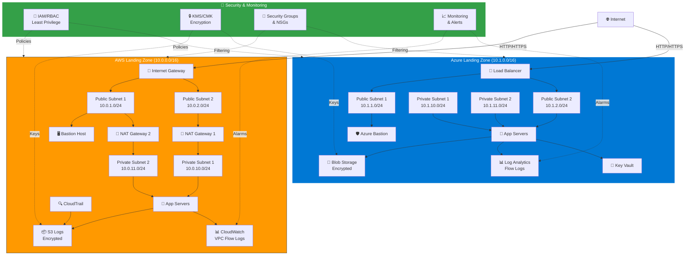
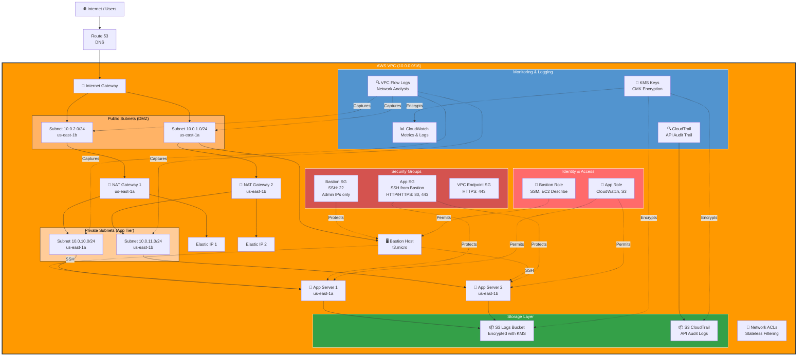
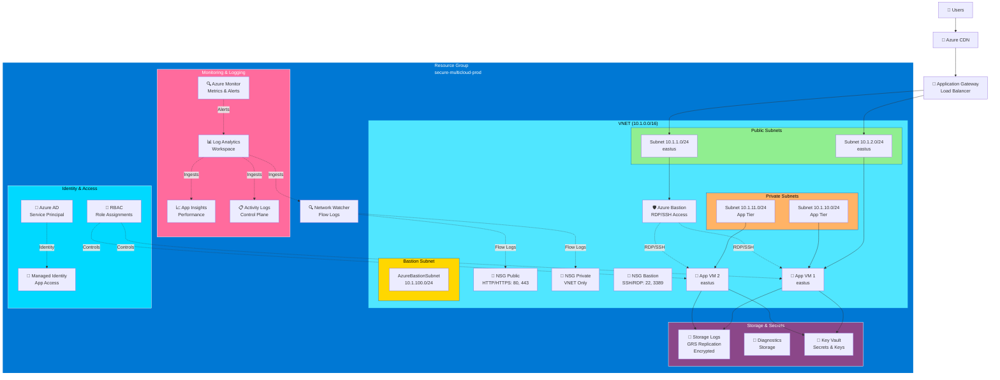
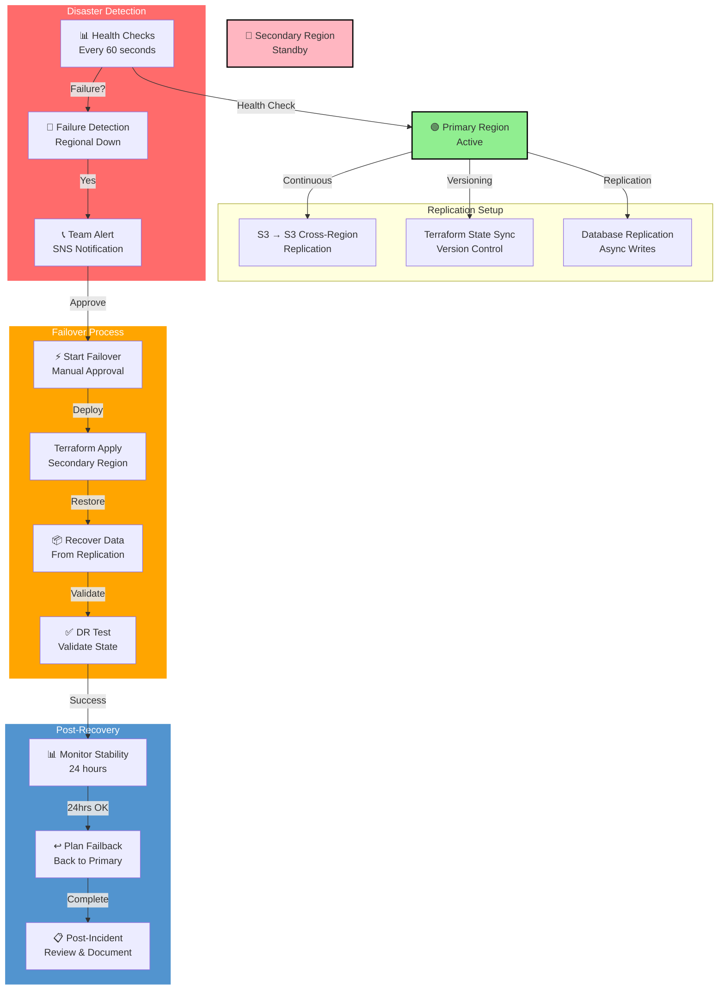
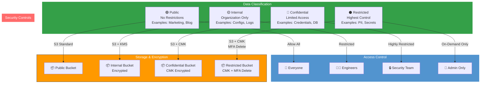
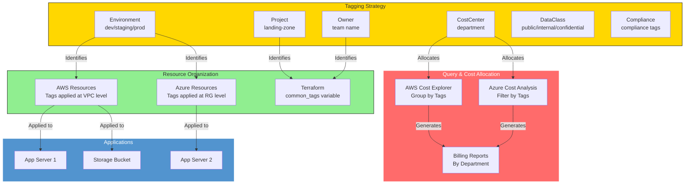

# Architecture Diagrams

## Multi-Cloud Landing Zone - High-Level Overview



---

## AWS Architecture - Detailed



---

## Azure Architecture - Detailed



---

## Security Architecture - Defense in Depth

```mermaid
graph TB
    Internet["🌐 Internet"]
    
    subgraph L0["Layer 0: DDoS Protection"]
        DDoS["AWS Shield / Azure DDoS<br/>Network-level protection"]
    end
    
    subgraph L1["Layer 1: Edge Security"]
        WAF["🛡️ WAF<br/>Application-level filtering"]
        Firewall["🚪 Firewall Rules<br/>Port/Protocol filtering"]
    end
    
    subgraph L2["Layer 2: Network Segmentation"]
        IGW["📡 Internet Gateway<br/>Controlled Access"]
        NSG["🚪 NSG / Security Groups<br/>Stateful Inspection"]
        NACL["🚪 NACLs<br/>Stateless Filtering"]
    end
    
    subgraph L3["Layer 3: Authentication & Authorization"]
        IAM["👤 IAM / RBAC<br/>Role-based Access"]
        MFA["🔐 MFA<br/>Multi-factor Auth"]
        ServiceAccount["🔑 Service Principals<br/>Managed Identities"]
    end
    
    subgraph L4["Layer 4: Data Protection"]
        Encryption["🔒 Encryption at Rest<br/>KMS / CMK"]
        TransitEnc["🔒 Encryption in Transit<br/>TLS 1.2+, HTTPS"]
        Masking["🔏 Data Masking<br/>Sensitive Fields"]
    end
    
    subgraph L5["Layer 5: Logging & Monitoring"]
        Audit["🔍 Audit Logging<br/>CloudTrail / Activity Logs"]
        FlowLogs["📊 VPC Flow Logs<br/>Network Traffic Analysis"]
        Monitoring["📈 Continuous Monitoring<br/>CloudWatch / Monitor"]
        SIEM["🚨 SIEM Integration<br/>Threat Detection"]
    end
    
    subgraph L6["Layer 6: Incident Response"]
        Detection["🔔 Anomaly Detection<br/>GuardDuty / Defender"]
        Response["⚡ Automated Response<br/>Runbooks & Playbooks"]
        Forensics["🔍 Forensics<br/>Log Analysis & Evidence"]
    end
    
    Internet --> DDoS
    DDoS --> WAF
    WAF --> Firewall
    Firewall --> IGW
    IGW --> NSG
    NSG --> NACL
    
    NACL --> IAM
    IAM --> MFA
    MFA --> ServiceAccount
    
    ServiceAccount --> Encryption
    ServiceAccount --> TransitEnc
    Encryption --> Masking
    
    Masking --> Audit
    Audit --> FlowLogs
    FlowLogs --> Monitoring
    Monitoring --> SIEM
    
    SIEM --> Detection
    Detection --> Response
    Response --> Forensics
    
    style L0 fill:#FF6B6B,stroke:#fff,color:#fff
    style L1 fill:#FF8E72,stroke:#fff,color:#fff
    style L2 fill:#FFA726,stroke:#fff,color:#fff
    style L3 fill:#FFD700,stroke:#000,color:#000
    style L4 fill:#90EE90,stroke:#000,color:#000
    style L5 fill:#5294CF,stroke:#fff,color:#fff
    style L6 fill:#8B4789,stroke:#fff,color:#fff
```



---

## Data Flow - Network Communication

```mermaid
graph LR
    subgraph Public["Public Internet"]
        User["👤 End User<br/>203.0.113.0"]
    end
    
    subgraph AWS["AWS"]
        ELB["⚖️ Elastic Load Balancer<br/>443 HTTPS"]
        Bastion["🖥️ Bastion Host<br/>Public Subnet"]
        App["🏃 App Server<br/>Private Subnet<br/>10.0.10.x"]
    end
    
    subgraph Azure["Azure"]
        AppGW["🔗 App Gateway<br/>443 HTTPS"]
        AzureApp["🏃 App Server<br/>Private Subnet<br/>10.1.10.x"]
    end
    
    subgraph Logs["Logging Infrastructure"]
        CloudTrail["📊 CloudTrail"]
        ActivityLog["📊 Activity Logs"]
        S3["📦 S3 Logs Bucket<br/>Encrypted"]
        BlobStore["💾 Azure Storage<br/>Encrypted"]
    end
    
    subgraph Cross["Cross-Cloud (Optional)"]
        VPN["🔐 VPN Gateway<br/>Encrypted Tunnel<br/>IPSec"]
    end
    
    User -->|1. HTTPS Request<br/>443| ELB
    ELB -->|2. Forward to<br/>App Server| App
    App -->|3. Process<br/>Request| App
    
    Bastion -->|4. SSH Access<br/>22| App
    App -->|5. Response| User
    
    ELB -->|6. Log Events| CloudTrail
    App -->|7. Send Logs| S3
    CloudTrail -->|8. Store Logs| S3
    
    User -->|9. HTTPS Request<br/>443| AppGW
    AppGW -->|10. Forward| AzureApp
    AzureApp -->|11. Response| User
    
    AppGW -->|12. Log Events| ActivityLog
    AzureApp -->|13. Send Logs| BlobStore
    ActivityLog -->|14. Archive| BlobStore
    
    App -->|15. (Optional)<br/>Sync| VPN
    VPN -->|16. Encrypted| AzureApp
    
    style Public fill:#FFE4E1,stroke:#000
    style AWS fill:#FF9900,stroke:#232F3E,color:#fff
    style Azure fill:#0078D4,stroke:#fff,color:#fff
    style Logs fill:#34A048,stroke:#fff,color:#fff
    style Cross fill:#8B4789,stroke:#fff,color:#fff
```

---

## Disaster Recovery Flow



---

## Data Classification & Access Control Matrix



---

## Tagging Strategy & Resource Organization


